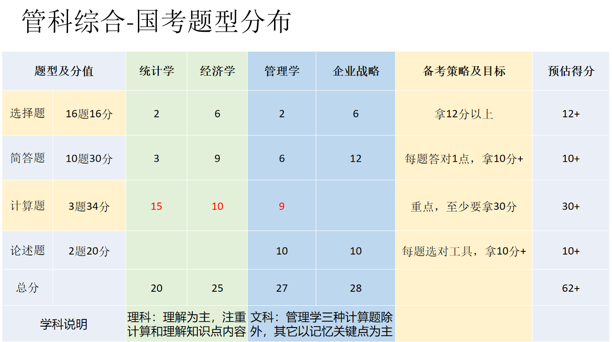
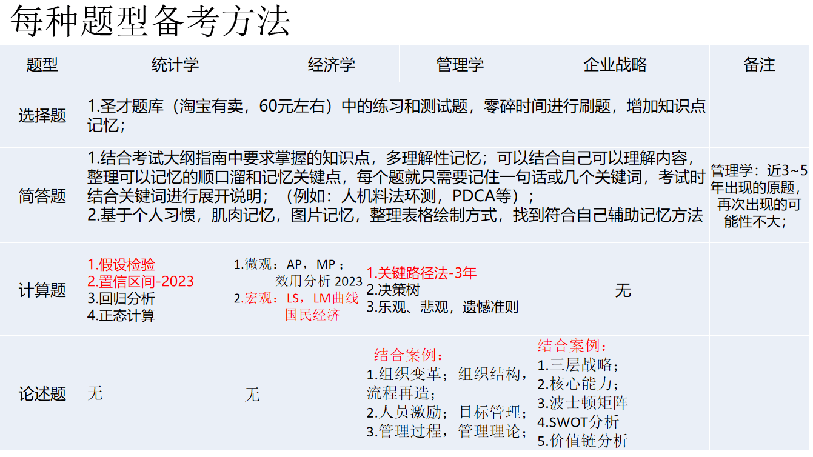
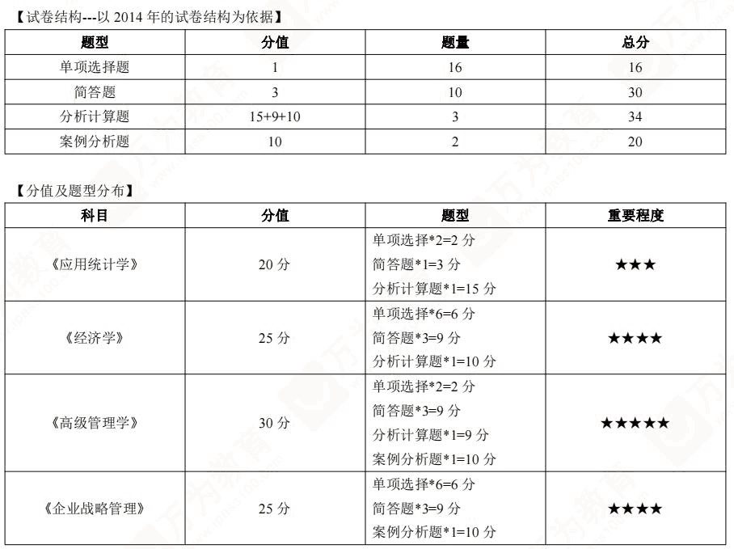

&emsp; 考试题型  
&emsp; 一、单选，16题，每题1分，共16分（统计学2题，2分；高级管理学和企业战略管理题8分，经济学6题，6分。）   
&emsp; 二、简答，10题，每题3分，共30分（统计学1题，3分；高级管理学和企业战略管理18分，经济学9分。）  
&emsp; 三、分析计算，3题，共34分（统计学15分，高级管理学和企业战略管理9分，经济学10分。）   
&emsp; 四、案例分析，2题，每题10分，共20分（高级管理学和企业战略管20分）    
&emsp; 考试要求，满分100,及格60分   

  
  
  

<!-- 
考点手册  
https://www.doc88.com/p-98539015300103.html
-->
