<!-- TOC -->

- [1. 数据的整理与图形表示](#1-数据的整理与图形表示)
    - [1.1. 数据的整理（`频数频率分布表`）](#11-数据的整理频数频率分布表)
    - [1.2. 数据的图形表示](#12-数据的图形表示)
    - [1.3. 数据的描述性指标](#13-数据的描述性指标)
        - [1.3.1. 数据的`【集中趋势】`的度量](#131-数据的集中趋势的度量)
        - [1.3.2. 数据的`【离散趋势】`度量](#132-数据的离散趋势度量)

<!-- /TOC -->

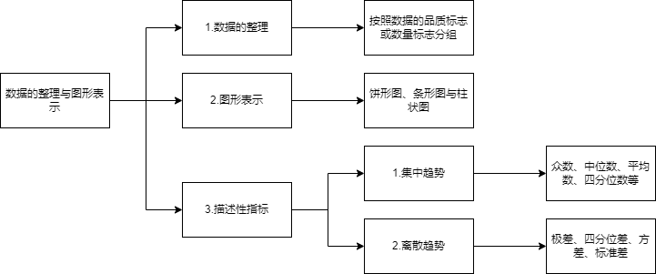  

# 1. 数据的整理与图形表示  

<!-- 
大纲  
&emsp; (1)考试范围  
&emsp; 数据的整理与图形表示，数据的描述性指标以及应用。  
&emsp; (2)考试要求  
&emsp; 掌握数据的分组方法，掌握数据的图形表示方法：直方图、饼形图、茎叶图、条形图，掌握将数据转化为频数或频率直方图的方法步骤，并能根据应用的要求选择适当的图形表示方法，并由这些图形获得数据的一般特征。  
&emsp; 掌握数据集中趋势的度量：众数、中数、平均数、四分位数；掌握数据变异趋势的度量：方差、标准差、极差、四分位差；了解以上度量方法的适用条件并能应用这些概念解释实际问题。 
-->
 

## 1.1. 数据的整理（`频数频率分布表`）  
&emsp; 数据整理也就是对数据按照品质标志或数量标志进行统计分组。在实际工作中按数据的某种`【标志分组】`，把全部数据在各组中的分配状况称为`【频率分布】`。分布在各组类的数据的个数称为频数，各组频数与全部平数之和的比值称为该组的频率。将分组标志各组频率品数列成表格，便形成了频数、频率分布表。  
&emsp; 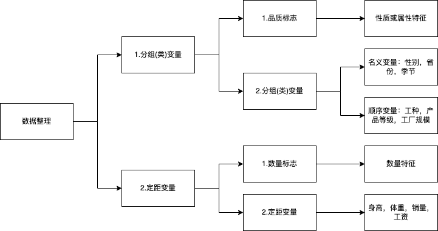  

1. 标志分组：  
    &emsp; 一般按照数据的`分组变量（品质标志）`或`定距变量（数量标志）`分组。  
    * 品质标志是表明事物的性质或属性特征的，如性别、颜色、产品等级、生产厂家等。  
    * 数量标志是说明事物数量特性的，如温度、产量、年龄、销售量等等，是可以用具体数值来体现的。  
2. 数据整理：  
    1. 如何依据`分组变量`进行数据的整理？  
    &emsp; 常用作法：先统计得到数据的频数分布，再列成频数频率分布表。  
    2. 如何依据`定距变量`进行数据的整理？  
    &emsp; 一般情形下，采用组距分组法（即等距分组），才能更好观察数据的取值分布。  
3. （2005年真题）  
&emsp; 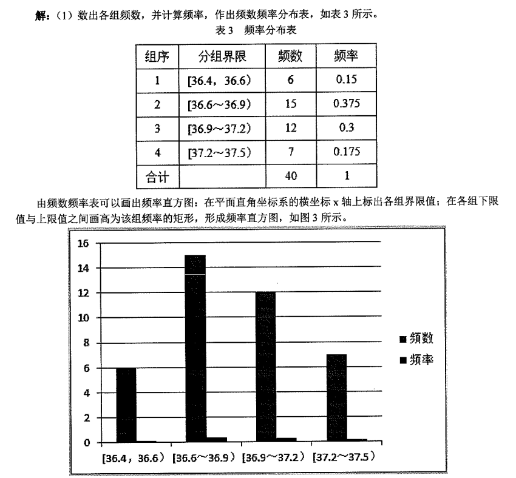  

## 1.2. 数据的图形表示  
&emsp; 在数据整理的基础上，用各种统计图形（`散点、条形、圆形`）描述数据：饼形图、条形图与柱状图、并列（复合）条形图或柱状图、频率直方图、茎叶图。  
&emsp; `1.定义；2.用途。`  
&emsp; 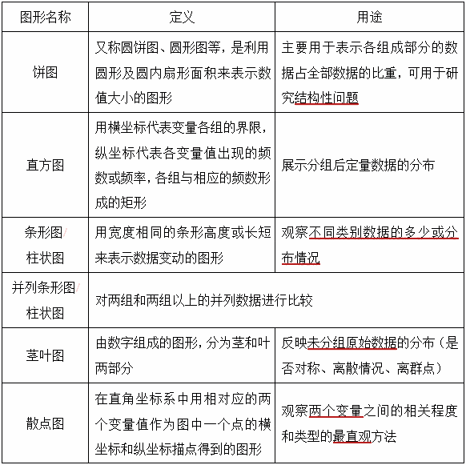  

1. 条形图与柱状图：    
&emsp; 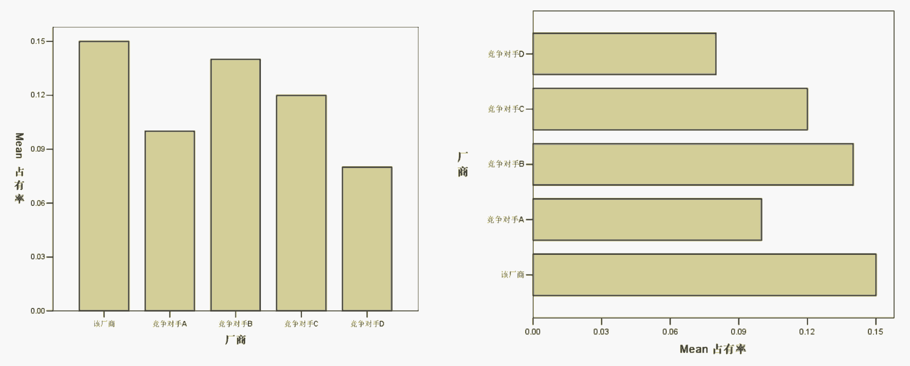  
&emsp; 细微区分：条的放置方式，条形图（水平），柱状图（垂直）。  
&emsp; 依时间变化情况多采用柱状图。  

2. 并列（复合）条形图或柱状图：   
&emsp; 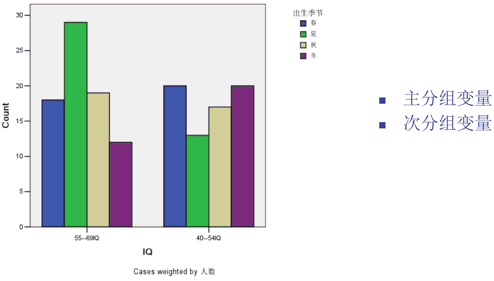  
&emsp; 意义：对两组或两组以上的并列数据进行比较。  

3. 频率直方图：   
&emsp; 频率直方图仅适用于定距变量。  

4. 茎叶图：  
&emsp; 茎叶图只是记录数据的一种图形方式，依据茎叶图可以复现数据集。   

5. 饼形图：  
&emsp; 饼形图用以直观显示部分对整体的比例关系，仅适用于分组变量。  
&emsp; 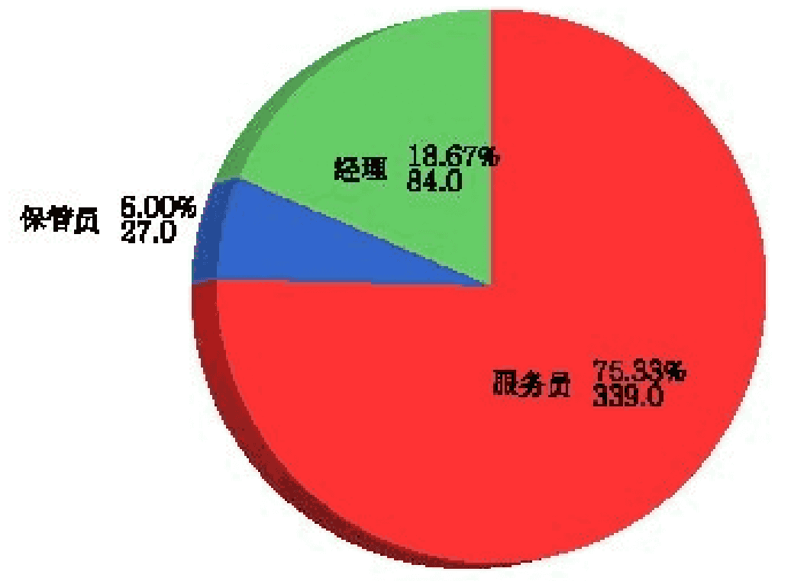  

6. 小结：  
&emsp; 数据标志不同，处理的相同与差异。  
&emsp; 选取合适的统计图形。  
&emsp; 赋予统计图形更多更好的实际意义。  

## 1.3. 数据的描述性指标  
&emsp; 数据的描述性指标，通常只适合于定距变量。数据`集中趋势`的度量和数据`离散趋势`的度量。  

### 1.3.1. 数据的`【集中趋势】`的度量   
1. 数据集中趋势的度量：描述数据的集中点或中心值。  
2. 常用的度量指标：  
&emsp; `1.概念；2.计算；3.特点。`  
&emsp; 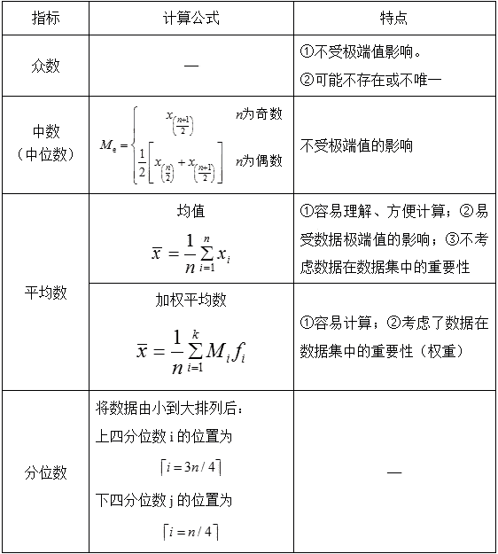  

1. 众数：出现次数（频数）最多的变量值。    
&emsp; 众数的主要缺点是一个数据集可能没有众数，或众数不惟一，而数据集的平均数和中数都是存在并且惟一的。它的优点是它反映了数据集中最常见的数值，即最普遍的数值，并且它不仅对数量型数据集有意义，对分类型数据集也有意义。  
&emsp; 众数不受极端值（奇异值）的影响，但可能不唯一。

2. 中数或中位数   
&emsp; 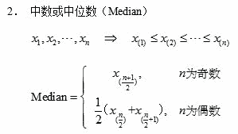  

&emsp; 中数对极端值不像平均数那么敏感，因此对于有极端值的数据集来说，采用中数描述其集中趋势一般比平均数更为合适。  
&emsp; 中位数不受极端值的影响，具有较高的稳健性，非常适用于具有极端值的情形。

3. 平均数或均值  
&emsp; 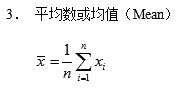   
&emsp; 平均数的优点在于它容易理解，易于计算。它的一个主要缺点是它对极端值特别敏感（所谓极端值就是数据集中特别大或特别小的个别数据）；它的另一个缺点是它不考虑数据在数据集中的重要性，一律平等对待。  
&emsp; 易于计算，具有抽样的稳定性，最为常用，但要考虑极端值的影响。

4. 加权平均数  
&emsp; 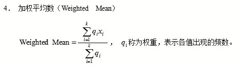   
&emsp; 加权平均数克服了平均数不考虑数据在数据集中重要性的缺陷，采用权重反映数据在数据集中的重要性，并且具有容易计算的优点。  
&emsp; 考虑了数据出现频数的差异，只适用于已分组的定距变量。

5. `四分位数`   
&emsp; 四分位数（Quartile）也称四分位点，是指在统计学中把所有数值由小到大排列并分成四等份，处于三个分割点位置的数值。多应用于统计学中的箱线图绘制。它是一组数据排序后处于25%和75%位置上的值。  
&emsp; 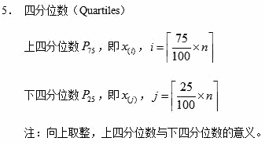    

6. `集中趋势的度量指标的比较`：    
&emsp; ①众数适用于数量型数据集、分类型数据集。  
&emsp; ②对于有极端值的数据集来说，中位数一般比平均数更为合适。  
&emsp; ③分位数中表示向上取整。  

### 1.3.2. 数据的`【离散趋势】`度量  
&emsp; 数据离散趋势的度量：描述数据之间的变异程度（离散程度）。    
&emsp; 数据离散趋势的度量常常用来作为衡量数据稳定性的工具，可以用来说明产品的质量是否稳定：离散度量数值越小质量越稳定。人们也常常用数据离散趋势的度量来说明一个事物的风险大小：离散度量数值越小说明风险越小，数值越大风险越大。 

&emsp; 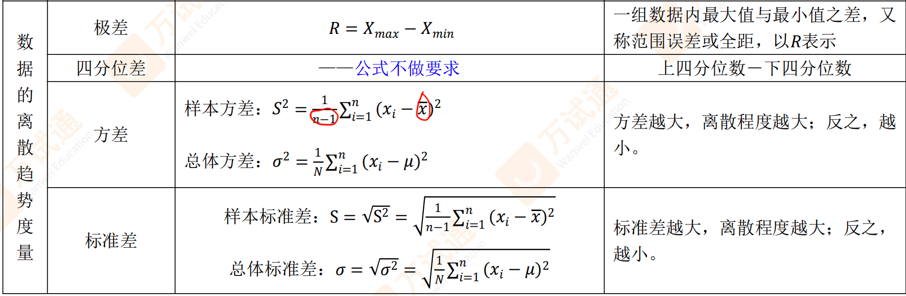    
&emsp; 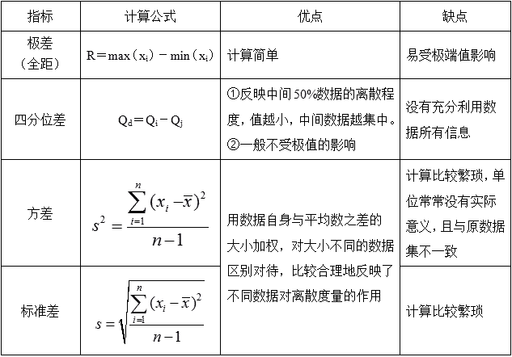    

1. 常用的度量指标：  
    1. 极差：  
    &emsp; 也称为全距，它是数据的最大值与最小值之差，表示数据的跨度。但是它易受极端数值的影响。  
    &emsp; 极差：特别容易受极端值的影响，极差越大，数据取值的差异越大。  

    2. 四分位差：即上四分位数与下四分位的差数。它一般不受极端数值的影响。  
    &emsp; 四分位差：不受极端值的影响，比极差稳定，在（P25，P75）间集中了最为“常见”的数据。  

    3. `【总体和样本】的分差和样本标准差`  
    &emsp; `【方差根据均值计算】；【标准差根据方差计算】。`  
    &emsp; 刻画了所有数据偏离其平均值的程度，具有抽样的稳定性，最为常用，但要考虑极端值的影响。   
    &emsp; 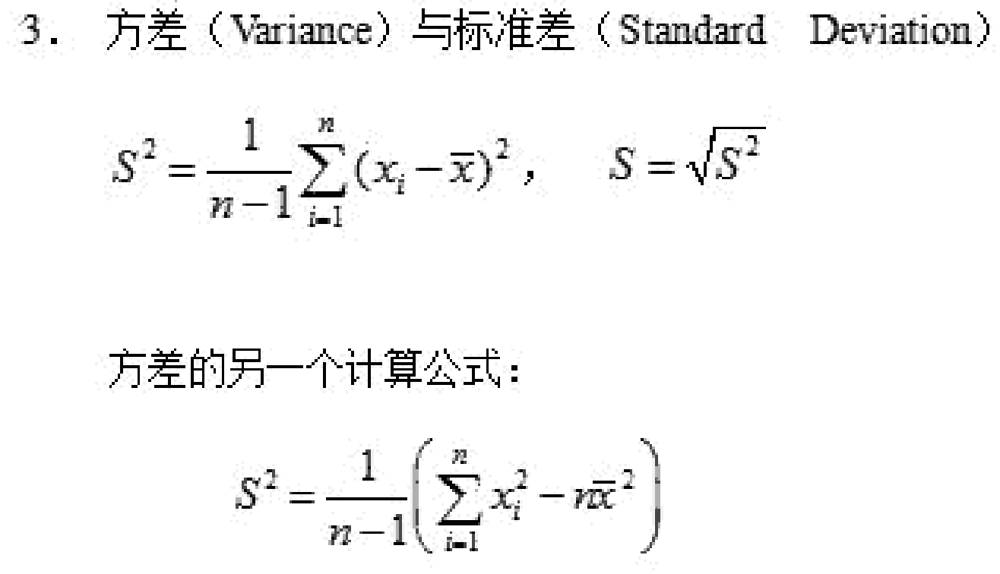    
    &emsp; 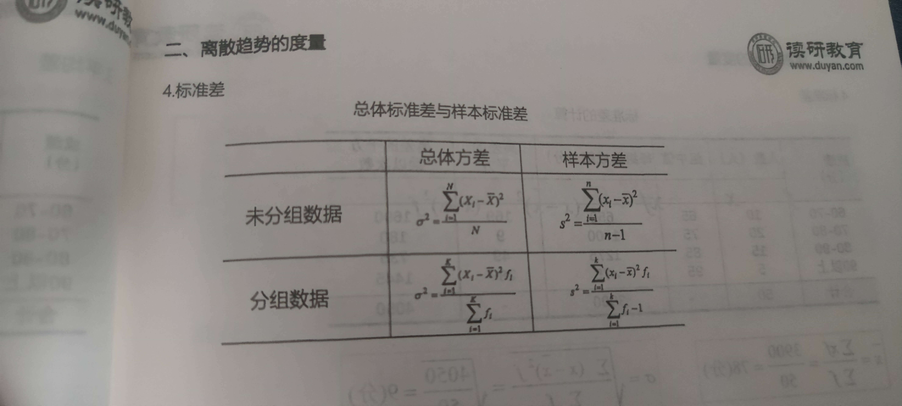    
    &emsp; 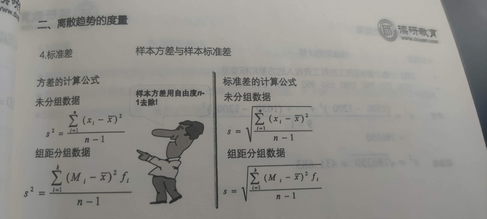    

2. 各种离散趋势度量的适用场合比较分析如下：  
    * 极差是最简单、最直观、最容易计算的度量数据离散程度的指标。但是，很明显，它特别容易受极端值的影响。  
    * 四分位差不像极差那么容易受极端值的影响，但是仍然存在没有充分利用数据所有信息的缺陷。  
    * 方差和标准差是统计中最常用的度量数据离散程度的指标，它用数据自身与平均数之差的大小加权，因而区别对待了大小不同的数据，距离平均数远的数据权重比较大，距离平均数近的数据权重比较小，比较合理地反映了不同数据对离散度量的作用。缺点是计算比较繁琐，并且方差的单位常常没有实际意义，且与原数据集不一致。  
    
3. 例题
    1. `（2004年真题）简要说明其【标准差】大小的实际意义。`  
    &emsp; 答：标准差是统计中常用的度量数据离散程度的指标， / 它是用数据自身与平均数之差的大小加权，因而区别对待了大小不同的数据， / 距离平均数远的数据权重比较大，距离平均数近的数据权重比较小，比较合理地反映了不同数据对离散度量的作用。  

    2. `（2010年真题）有人说：“当数据偏态程度较大时，应选择众数或者中位数等代表集中趋势，而不应使用均值。” 这话对吗?为什么？`  
    &emsp; 答：正确。具体分析如下：当数据偏态程度较大时，说明数据中存在极端值。而均值的一个主要缺点是它对极端值特别敏感（极端值就是数据集中特别大或特别小的个别数据）。但是中位数和众数对极端值不像平均数那么敏感，受极端值的影响较小，具有统计上的稳健性，所以当数据偏态程度较大时，应选择众数或者中位数等代表集中趋势。  
