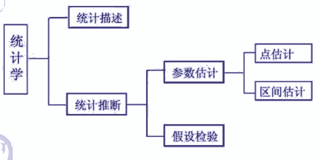

&emsp; `5种题型`：   
1. 求概率 - 概率分布函数    
2. 点估计 - 距估计  
2. 区间估计 - 求解置信区间    
4. 假设校验  
5. 线性回归
6. 时间序列  


[1.数据的整理与图形表示](/docs/comprehensiveManageDepart/appliedStatistics/DataImage.md)   
[2.概率分布/随机变量（个体）以及抽样分布（总体）](/docs/comprehensiveManageDepart/appliedStatistics/RandomSampling.md)   
&emsp; [2.1.概率分布/随机变量](/docs/comprehensiveManageDepart/appliedStatistics/ProbabilityDistribution.md)   
&emsp; [2.2.★★★抽样分布](/docs/comprehensiveManageDepart/appliedStatistics/SamplingDistribution.md)   
[附录：公式1](/docs/comprehensiveManageDepart/appliedStatistics/formulaOne.md)   
[3.参数估计](/docs/comprehensiveManageDepart/appliedStatistics/parameterEstime.md)   
&emsp; [3.1.参数的点估计](/docs/comprehensiveManageDepart/appliedStatistics/pointEstimation.md)   
&emsp; [3.2.参数的区间估计](/docs/comprehensiveManageDepart/appliedStatistics/intervalEstimation.md)   
[4.假设检验](/docs/comprehensiveManageDepart/appliedStatistics/hypothesisTest.md)   
[5.1.线性回归分析](/docs/comprehensiveManageDepart/appliedStatistics/linearRegression.md)   
[5.2.多元线性回归](/docs/comprehensiveManageDepart/appliedStatistics/linearRegressionTwo.md)   
[6.时间序列分析](/docs/comprehensiveManageDepart/appliedStatistics/timeSeries.md)   
[附录：公式2](/docs/comprehensiveManageDepart/appliedStatistics/formula.md)   
[人大考试](/docs/comprehensiveManageDepart/appliedStatistics/RDKS.md)  

  

&emsp; 统计学分为描述性统计和推断统计两大部分。  
* 描述性统计可以继续细分为图表法和数值法。  
* 而推断统计则包含概率论、抽样理论、估计理论、假设检验这四大组成部分。这四大组成部分是层层递进的，是各种统计分析方法的基础，在此基础之上各种各样的统计方法层出不穷，因此充分掌握这些基础知识，可以使我们更好、更灵活地运用统计分析方法。  

--------------------------- 

&emsp; 点睛讲义：  
```pdf
/docs/comprehensiveManageDepart/appliedStatistics/pdf1/punchline.pdf
```


<!-- 
https://www.zhihu.com/people/mysticsprite

概率论2.8-正态分布
https://zhuanlan.zhihu.com/p/570052800
概率论2.9-随机变量函数的分布
https://zhuanlan.zhihu.com/p/570063449

概率论4.1-常用概率分布及其期望和方差
https://zhuanlan.zhihu.com/p/570271607
原点矩和中心距
https://zhuanlan.zhihu.com/p/570470390

数理统计6.1-总体与样本
https://zhuanlan.zhihu.com/p/570663696
数理统计6.2-统计量及抽样分布
https://zhuanlan.zhihu.com/p/570880924
数理统计6.3-抽样分布之卡方分布
https://zhuanlan.zhihu.com/p/570885119
数理统计6.4-抽样分布之t分布
https://zhuanlan.zhihu.com/p/570888939
数理统计6.5-抽样分布之F分布
https://zhuanlan.zhihu.com/p/570889936
数理统计6.!-抽样分布是什么
https://zhuanlan.zhihu.com/p/571113624
数理统计6.6-正态总体下的三大抽样分布
https://zhuanlan.zhihu.com/p/571114852


数理统计7.1-点估计之矩估计
https://zhuanlan.zhihu.com/p/571342090
点估计的优良性准则
https://zhuanlan.zhihu.com/p/572349453
数理统计7.4-区间估计概念
https://zhuanlan.zhihu.com/p/573059141
数理统计7.5-一个总体下参数的区间估计
https://zhuanlan.zhihu.com/p/573060738


数理统计8.1-假设检验原理与思想
https://zhuanlan.zhihu.com/p/574208554
假设检验的逻辑是是什么？
https://www.zhihu.com/question/20254932/answer/2719366302
数理统计8.2-假设检验基础概念
https://zhuanlan.zhihu.com/p/574779727
一个正态总体下的假设检验
https://zhuanlan.zhihu.com/p/575476427
两个正态总体下的假设检验
https://zhuanlan.zhihu.com/p/575614216


2、什么是回归分析
https://zhuanlan.zhihu.com/p/581404509
3、经典线性回归模型
https://zhuanlan.zhihu.com/p/581497944
多元线性回归模型
https://zhuanlan.zhihu.com/p/582202436

-->
